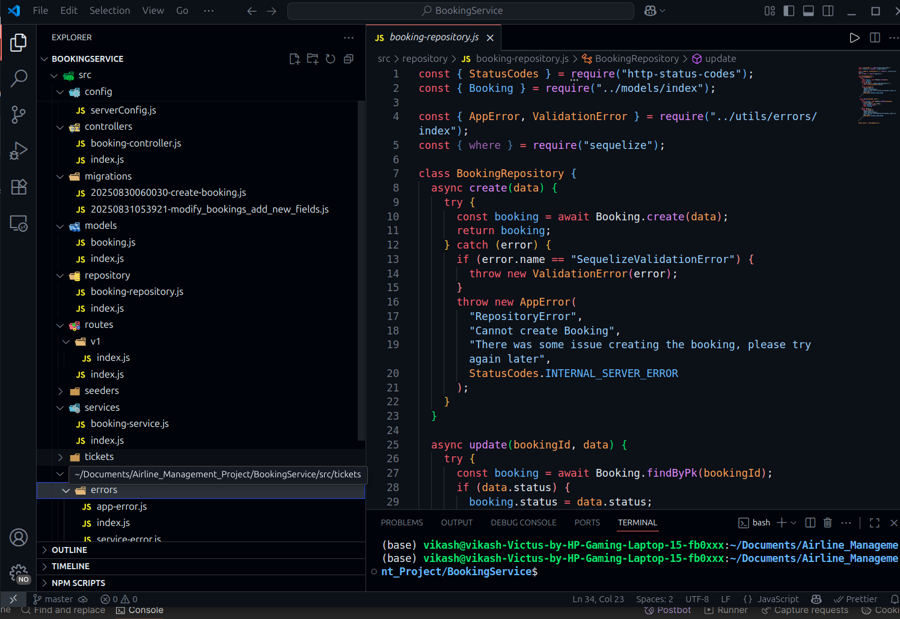

# AirTicket Booking Service

This repository contains the **Booking Service** for the AirTicket airline backend.  
It is part of the **microservices architecture** and handles all **flight booking operations**.

## Overview

- Built using **Node.js**, structured modularly using files and functions (instead of classes).
- Responsible for **creating, updating, retrieving, and cancelling bookings**.
- Designed to work with the **API Gateway**, which routes requests to this service.
- Supports **integration with other services** (Flight, User) via API calls.
- Serves **static assets** like images from the `assets` folder.

---

## Architecture

```
API Gateway → Booking Service → Database
            ↑
Flight & User Services integration
```

---

## Features

- **Booking Management**:

  - Create new bookings
  - Update or cancel existing bookings
  - Retrieve booking details

- **API Gateway Integration**:

  - Receives requests routed through the API Gateway
  - Performs basic validation before processing requests

- **Modular JavaScript Structure**:

  - Functions organized by feature for clarity
  - Separate modules for database operations, request validation, and business logic

- **Asset Management**:
  - Images and static assets served from the `assets` folder

---

## Learning Outcomes

- Hands-on experience with **microservices architecture** in Node.js.
- Learned **modular JavaScript design** for clean, maintainable code.
- Integrated **Booking Service** with other microservices via API Gateway.
- Managed **static assets** efficiently for service usage.

---

## Usage

1. Clone the repository:

```
git clone git@github.com:VIKASH1596KUMARKHARWAR/AirTicket_BookingService.git
cd AirTicket_Booking_Service
```

2. Install dependencies and start the server
   ` npm install and npm start`

3. Hit the routes

```
   localhost:3002/api/v1/bookings

   with flightId,userId,noOfSeats
```

```
{
    "message": "Booking created successfully and messages published",
    "success": true,
    "err": {},
    "data": {
        "id": 39,
        "flightId": 7,
        "userId": 2,
        "status": "Booked",
        "noOfSeats": 4,
        "totalCost": 32000,
        "createdAt": "2025-09-04T05:57:35.000Z",
        "updatedAt": "2025-09-04T05:57:35.303Z"
    }
}
```

  
_Booking routes_

### learnings

- 1. Modular project structure

  
_modular project structure_

- 2. Gracefully Handel error

  
_Gracefully Handel error_

3. Clean code and class Based approach

     
   _Clean code and class Based approach_
